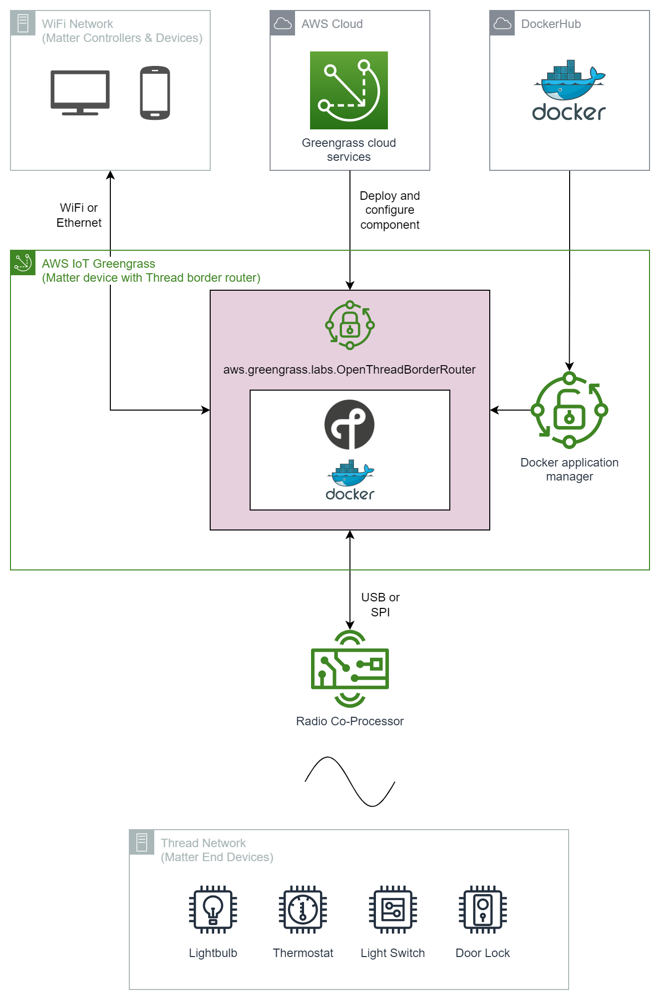

# AWS Greengrass Labs OpenThread Border Router

This respository packages the [OpenThread Border Router](https://openthread.io/guides/border-router) Docker [container from DockerHub](https://hub.docker.com/r/openthread/otbr) into an AWS IoT Greengrass component for deployment to Greengrass core edge devices. This helps to illustrate how Greengrass can be used to compose, deploy and manage mains-powered [Matter smart home devices](https://csa-iot.org/all-solutions/matter/) that include a Thread Border Router.

# Repository Contents

| Item                          | Description                                                         |
| ----------------------------- | ------------------------------------------------------------------- |
| /images                       | Images for README file.                                             |
| gdk-config.json               | Configuration for the Greengrass Development Kit (GDK) - Command Line Interface.                      |
| recipe.yaml                   | Greengrass component recipe.                                        |

# Architecture

An overview of the system architecture is presented below.



The **aws.greengrass.labs.OpenThreadBorderRouter** component is a thin wrapper around a conventional OpenThread Border Router container deployment.

OpenThread Border Router is published as a Docker image on Docker Hub. This Greengrass component downloads the selected Docker image from Docker Hub with the help of the [Docker application manager](https://docs.aws.amazon.com/greengrass/v2/developerguide/docker-application-manager-component.html) managed component.

OpenThread Border Router expects a Thread [Radio Co-Processor (RCP)](https://openthread.io/platforms/co-processor#radio_co-processor_rcp) to be connected to the host system by USB-serial or Serial Peripheral Interface (SPI). There are numerous [vendor RCP options](https://openthread.io/vendors).

Using the RCP, OpenThread Border Router is able to route traffic between the WiFi and Thread parts of a Matter network.

# Requirements and Prerequisites

## Greengrass Core Device

This component requires that the Greengrass device be running a Linux operating system. It [supports all architectures supported by Greengrass itself](https://docs.aws.amazon.com/greengrass/v2/developerguide/setting-up.html#greengrass-v2-supported-platforms).

Your core device must [meet the requirements to run a Docker container using Docker Hub](https://docs.aws.amazon.com/greengrass/v2/developerguide/run-docker-container.html).

## Developer Machine

The component can be published to your account using either the [AWS CLI](https://docs.aws.amazon.com/systems-manager/latest/userguide/getting-started-cli.html) or the [Greengrass Development Kit (GDK) - Command Line Interface (CLI)](https://github.com/aws-greengrass/aws-greengrass-gdk-cli). The GDK CLI can be installed as follows:

```
pip3 install git+https://github.com/aws-greengrass/aws-greengrass-gdk-cli.git
```

# Getting Started

Please ensure that all [Requirements and Prerequisites](#requirements-and-prerequisites) have been met before deploying the component.

## Configuration

### Docker Image

The [recipe.yaml](recipe.yaml) can be modified to change the selected Docker image. At the time of writing, the OpenThread Border Router images were not tagged with versions, so the **latest** tag is used in the recipe. The recipe deletes dangling images to prevent a build up of images as the **latest** tag is updated. For production deployments a version tag should be used.

As an alternative, [Silicon Labs publish version-tagged OpenThread Border Router images to Docker Hub](https://hub.docker.com/r/siliconlabsinc/openthread-border-router). However these images are only available for **armv7l** architecture and not **amd64** nor **aarch64**. Please also take note of the Silicon Labs' Master Software License Agreement (MSLA). Should you use this image, please also update the `REPO` environment variable in the recipe.

### Component Configuration

The component supports the following [component configuration](https://docs.aws.amazon.com/greengrass/v2/developerguide/update-component-configurations.html) options.

| Name              | Default                                              | Description |
| ----------------- | ---------------------------------------------------- | ----------- |
| port              | 80                                                   | The TCP port of the OTBR Web GUI. |
| volume            | /dev/ttyACM0:/dev/ttyACM0                            | Maps the TTY device of the Radio Co-Processor (RCP). |
| radioUrl          | spinel+hdlc+uart:///dev/ttyACM0?uart-baudrate=460800 | The protocol, hardware interface and communication rate of the RCP. |
| backboneInterface | eth0                                                 | The network interface to use for the OpenThread backbone. |

These correlate with the OpenThread Border Router Docker container options.

## Publish

### AWS CLI

Using the AWS CLI:

```
aws greengrassv2 create-component-version --inline-recipe fileb://./recipe.yaml
```

### GDK CLI

Using the GDK CLI:

```
gdk component build
gdk component publish
```

# Using OTBR

## Web GUI

You can access the [OTBR Web GUI](https://openthread.io/guides/border-router/web-gui) by browsing to the IP address of the Greengrass core device, and using the TCP port defined in the component configuration.

## OpenThread CLI

The [OpenThread CLI](https://openthread.io/reference/cli) can be accessed on the Greengrass core device using the following command.

```
docker exec -ti otbr sh -c "sudo ot-ctl"
```

## Logs

The Greengrass component logs can be found accessed as follows:

```
sudo tail -f /greengrass/v2/logs/aws.greengrass.labs.OpenThreadBorderRouter.log
```

Or by going direct to the Docker container:

```
docker logs otbr -f 
```

# Testing

This component has been tested on a Raspberry Pi4 with the **linux/arm/v7** OpenThread Border Router image. And with the following Radio Co-Processor (RCP) devices:

- [Silicon Labs xG24 Explorer Board (BRD2703A)](https://www.silabs.com/development-tools/wireless/efr32xg24-explorer-kit?tab=overview) with [pre-compiled RCP binary 1.1.0-1.1](https://github.com/SiliconLabs/matter/releases/tag/v1.1.0-1.1).
- [Silicon Labs Thunderboard Sense 2 (BRD4166A)](https://www.silabs.com/documents/public/user-guides/ug309-sltb004a-user-guide.pdf) with [pre-compiled RCP binary 1.1.0-1.1](https://github.com/SiliconLabs/matter/releases/tag/v1.1.0-1.1).
